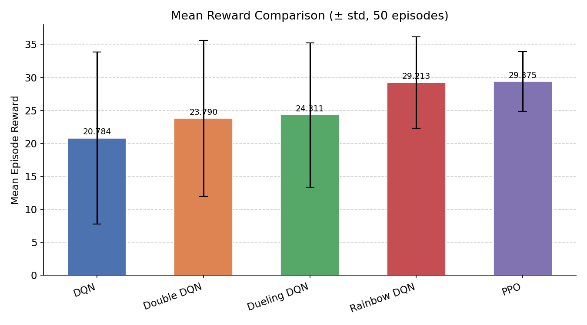
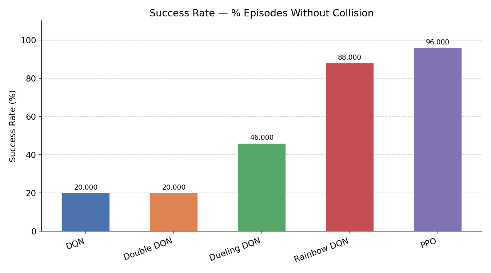
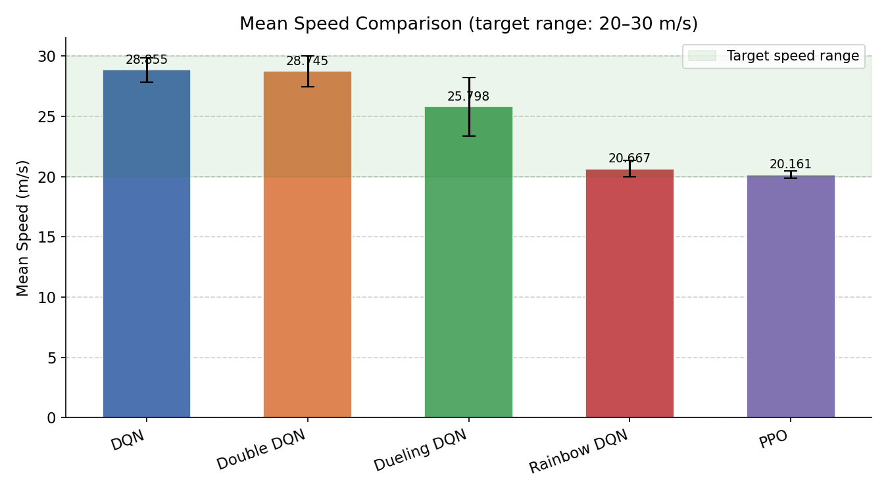
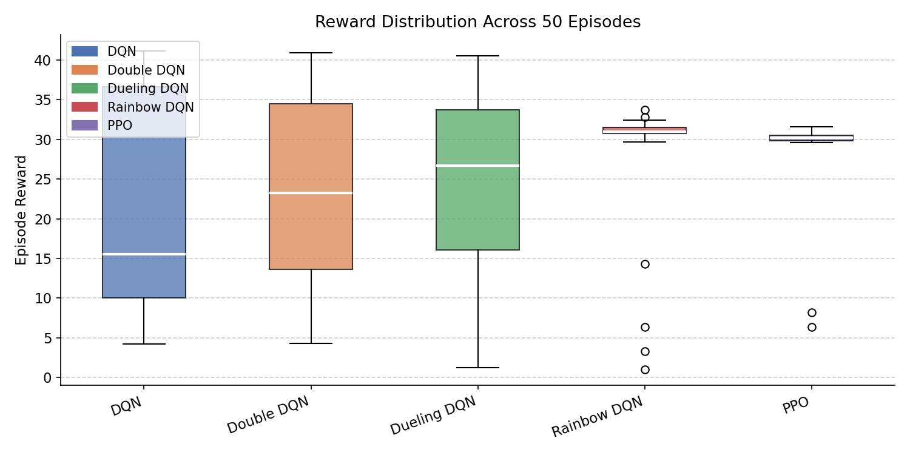
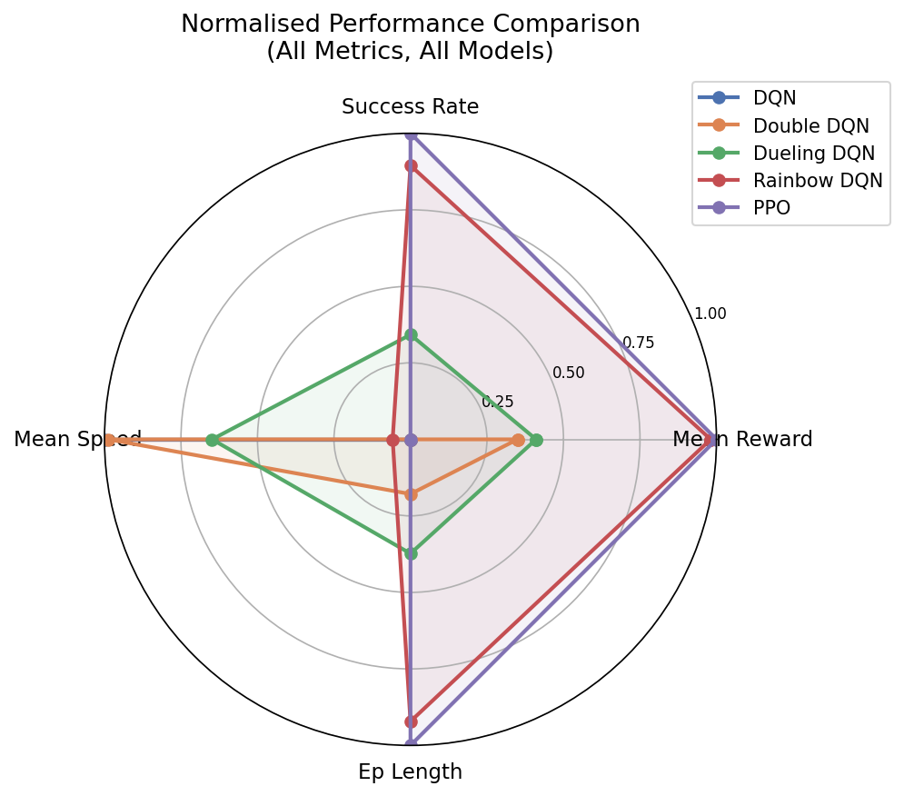

# 🚗 Autonomous Highway Driving with Deep Reinforcement Learning

[](https://www.python.org/)
[](https://stable-baselines3.readthedocs.io/)
[](https://highway-env.farama.org/)

A comprehensive comparison of Deep Reinforcement Learning algorithms for autonomous tactical decision-making in dense highway traffic.

---

## 🎯 Project Overview

This project implements and compares five different Reinforcement Learning algorithms to train an autonomous agent to navigate a 4-lane highway. The agent must optimize speed, maintain lane discipline, and most importantly, avoid collisions in a dynamic environment with 50 other vehicles.

### 🧠 Algorithms Implemented
- **DQN**: Vanilla Deep Q-Network (Baseline)
- **Double DQN**: Addresses overestimation bias by decoupling action selection from evaluation.
- **Dueling DQN**: Separates state value $V(s)$ from action advantage $A(s,a)$ for better generalization.
- **Rainbow DQN**: Combines Double DQN, Dueling DQN, Noisy Networks, Multi-step returns, and Prioritized Experience Replay.
- **PPO**: Proximal Policy Optimization (Actor-Critic method) for stable and consistent convergence.

---

## 🛠️ Tech Stack

| Category | Technology |
|----------|------------|
| **RL Environment** | [highway-env](https://highway-env.farama.org/) (Gymnasium) |
| **RL Framework** | [Stable-Baselines3](https://stable-baselines3.readthedocs.io/) |
| **Deep Learning** | [PyTorch](https://pytorch.org/) |
| **Experiment Tracking** | [TensorBoard](https://www.tensorflow.org/tensorboard) |
| **Visualization** | Matplotlib, Pygame |

---

## 📐 Markov Decision Process (MDP)

The problem is formulated as an MDP: $\text{MDP} = (S, A, P, R, \gamma)$

- **State Space ($S$):** 90-dimensional kinematic vector (position & velocity of the 15 nearest vehicles).
- **Action Space ($A$):** Discrete set: `{LANE_LEFT, IDLE, LANE_RIGHT, FASTER, SLOWER}`.
- **Reward Function ($R$):**
  $$R = 0.4 \cdot R_{\text{speed}} + 0.1 \cdot R_{\text{lane}} + R_{\text{collision}}$$
  - **Speed Reward:** Encourages maintaining speed between 20-30 m/s.
  - **Lane Reward:** Custom bonus for staying in the leftmost (overtaking) lane.
  - **Collision Penalty:** High negative reward (-1 normalized) for crashes.
- **Discount Factor ($\gamma$):** 0.99 (focus on long-term safety and speed).

---

## 📊 Experimental Results: Theory vs. Reality

### Theoretical Prediction
1. **Rainbow DQN** (Most components)
2. **Dueling DQN**
3. **Double DQN**
4. **PPO**
5. **DQN**

### Actual Performance (Evaluation over 50 episodes)

| Model | Success Rate | Mean Reward | Mean Speed | Collision Rate |
|-------|--------------|-------------|------------|----------------|
| **PPO** | **96%** | **29.38 ± 4.54** | 20.16 m/s | 4% |
| **Rainbow** | 88% | 29.21 ± 6.95 | 20.67 m/s | 12% |
| **Dueling DQN** | 46% | 24.31 ± 10.94 | 25.80 m/s | 54% |
| **Double DQN** | 20% | 23.79 ± 11.83 | 28.75 m/s | 80% |
| **DQN** | 20% | 20.78 ± 13.04 | 28.85 m/s | 80% |

### 🛠️ Key Insights
- **On-Policy vs. Off-Policy**: PPO (On-policy) significantly outperformed the DQN family (Off-policy) in dense traffic. This is because PPO learns from fresh interactions, whereas DQN reuses stale, crash-prone data from earlier policies.
- **Exploration**: PPO's stochastic policy provides more stable exploration compared to the abrupt random actions of $\epsilon$-greedy exploration in DQNs.
- **Training Stability**: The clipping mechanism in PPO prevents catastrophic policy updates, leading to a much higher success rate (96%).

---

## 🖼️ Visual Results

### 📈 Training Curves

*Comparison of reward convergence across all algorithms over 300,000 steps.*

### 📊 Performance Comparison
| Mean Reward | Success Rate |
|:---:|:---:|
|  |  |

| Mean Speed | Reward Distribution |
|:---:|:---:|
|  |  |

### 🕸️ Radar Analysis

*Multi-dimensional comparison: Speed, Success, Reward, and Stability.*

---

## 🚀 Quick Start

### 1. Installation
```bash
pip install -r requirements.txt
```

### 2. Visualize the Trained Agent
```bash
python scripts/evaluation/showcase.py
```

### 3. Evaluate Performance
```bash
python scripts/evaluation/evaluate_all_models.py
```

### 4. Training
To train an agent (e.g., PPO):
```bash
python scripts/training/train_ppo.py
```

---

## 📁 Project Structure
```
├── 📂 models/           # Pre-trained model checkpoints
├── 📂 results/          # Performance plots and metrics
│   └── 📂 plots/        # Visualization of agent performance
├── 📂 scripts/          # Training and evaluation logic
│   ├── 📂 training/     # Algorithm-specific training scripts
│   └── 📂 evaluation/   # Benchmarking and rendering scripts
├── requirements.txt     # Python dependencies
└── README.md            # You are here
```

---

## 🔗 Resources
- [Highway-env Documentation](https://highway-env.farama.org/)
- [Stable-Baselines3 Docs](https://stable-baselines3.readthedocs.io/)
- [PPO Paper](https://arxiv.org/abs/1707.06347)
- [Rainbow DQN Paper](https://arxiv.org/abs/1710.02298)

---

**Educational project for Reinforcement Learning research.**
